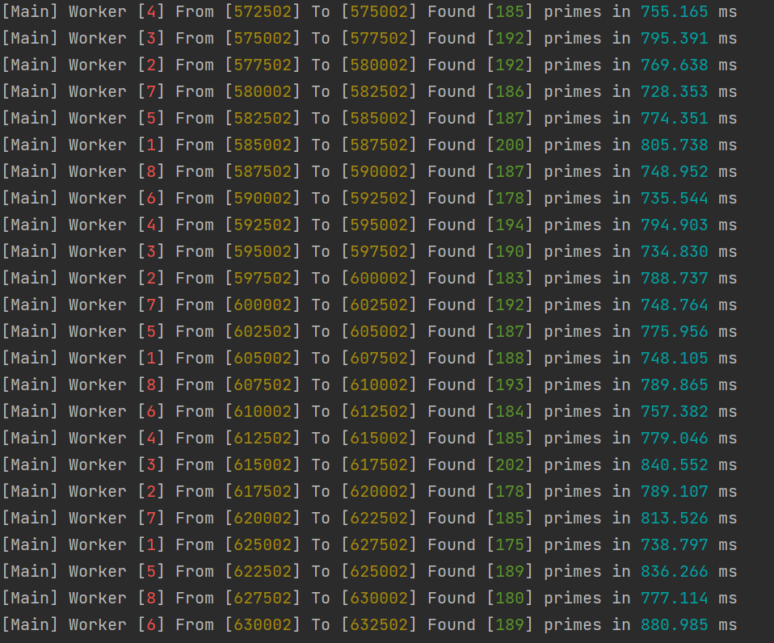
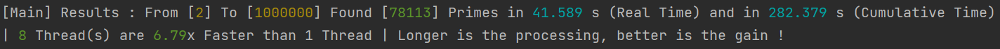

# NodeJS Multithreading 07

Prime Number processing

### Environment :
```
NodeJS minimal version: v12.x.x LTS (Erbium)
NodeJS recommended version: Latest LTS version
Dev Language: TypeScript (ES6)
Run Language: JavaScript
```
See [Latest NodeJS LTS version](https://nodejs.org/)

### How to run

#### First

Install packages

```
npm run i
```

#### Then

To run in Development
```
npm run start:dev
```

To run in Production
```
npm run start
```

## Explanations

As an example, I will show you a prime number calculator i've made.

<div align="center">

</div>

Main thread after starting 8 workers, send them ranges of number to check.

When one of the number can be divided by all his predecessor, it's a prime !


So each thread process in parallel a chunk of numbers and send back the primes one to main thread.

<div align="center">

</div>

In this test, using 8 threads is 6.79x faster than 1 thread.


My computer was doing some other processes at this time and there is an overhead at using multithreading. This explain why it's "only" 6.79x faster and not 8x faster.


Also my CPU is a 6 cores / 12 threads.

You can get source code on this repo and run it.

## Next Chapter

This is the end of this course.